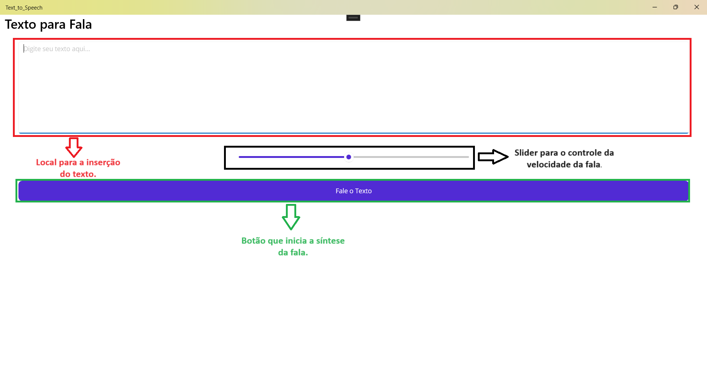

# Text-to-Speech with .NET-MAUI

Este repositório é um tutorial de implementação de um aplicativo que converte texto para fala (Text-to-Speech), com auxílio do framework .NET MAUI.

## Índice
- [Aplicativo](#Aplicativo)
- [Uso](#uso)
- [Contribuição](#contribuição)
- [Licença](#licença)

## Aplicativo
Veja, na imagem abaixo, o funcionamento do aplicativo:

