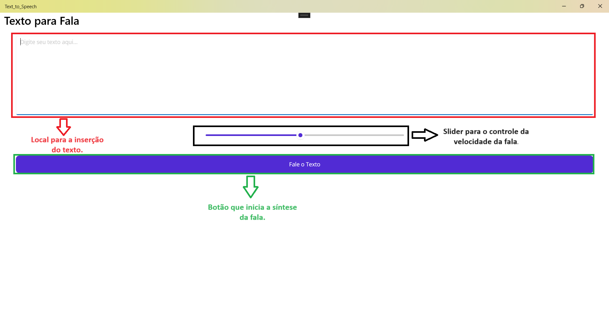

# Text-to-Speech with .NET-MAUI

Este repositório é um tutorial de implementação de um aplicativo que converte texto para fala (Text-to-Speech), com auxílio do framework .NET MAUI.

## Índice
- [Aplicativo](#Aplicativo)
- [Tutorial](#Tutorial)
- [Contribuição](#contribuição)
- [Licença](#licença)

## Aplicativo
O aplicativo de Text-to Speech possui a seguinte estrutura:
  - Campo de Texto, onde o usuário deve digitar seu texto;
  - Slider de velocidades, que controla a velocidade de fala;
  - Botão, o qual inicia a síntese de fala.

Veja, na imagem abaixo, o funcionamento do aplicativo:

## Tutorial
### Criando a interface no arquivo MainPage.xaml
